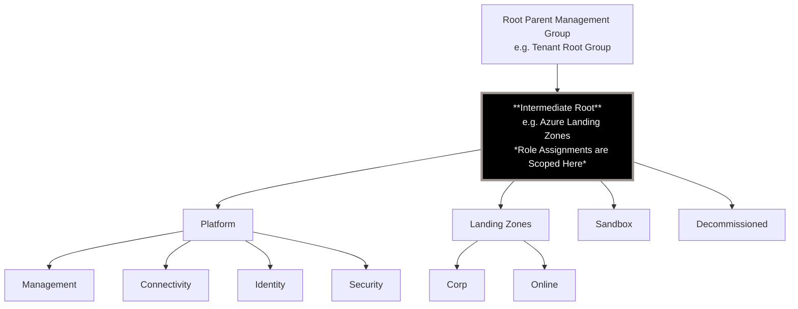

## Questions about the permissions applied during the bootstrap

### What permissions are applied to the User Assigned Managed Identities (UAMI) created during the bootstrap?

During the bootstrap process, the following permissions are applied to the UAMIs created for Plan and Apply operations:

The following diagram shows the management group hierarchy and highlights the scope at which the permissions are applied:

#### Terraform

- **Plan UAMI**:
  - `Reader` at the intermediate root management group scope.
  - `Storage Blob Data Contributor` on the storage account container used for Terraform state.

- **Apply UAMI**:
  - `Owner` at the intermediate root management group scope.
  - `Storage Blob Data Contributor` on the storage account container used for Terraform state.

#### Bicep

- **What If UAMI**:
  - `Reader` at the intermediate root management group scope.
  - `Custom Role Definition` with `Microsoft.Resources/deployments/whatIf/action` and `Microsoft.Resources/deployments/validate/action` actions at the intermediate root management group scope.

- **Apply UAMI**:
  - `Owner` at the intermediate root management group scope.
